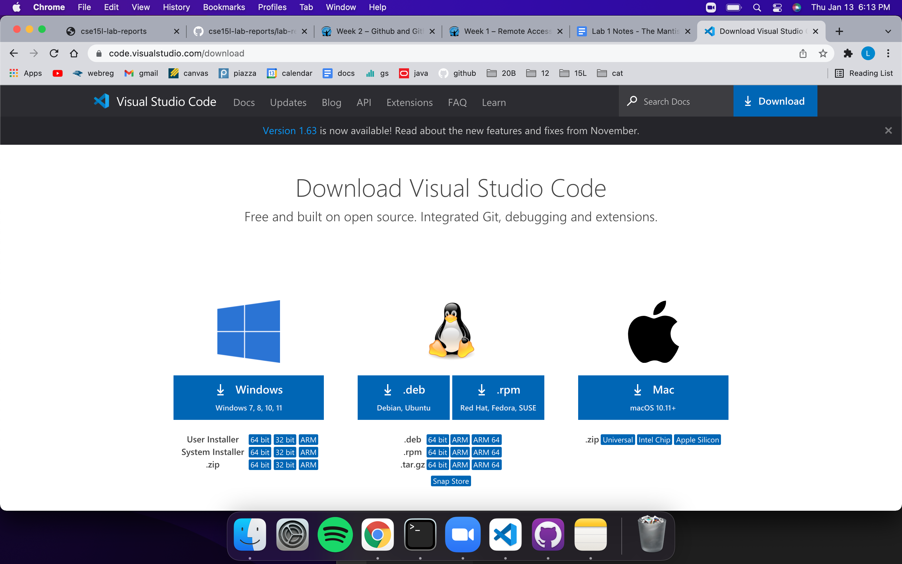
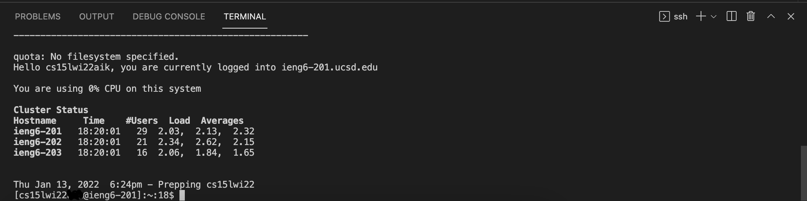
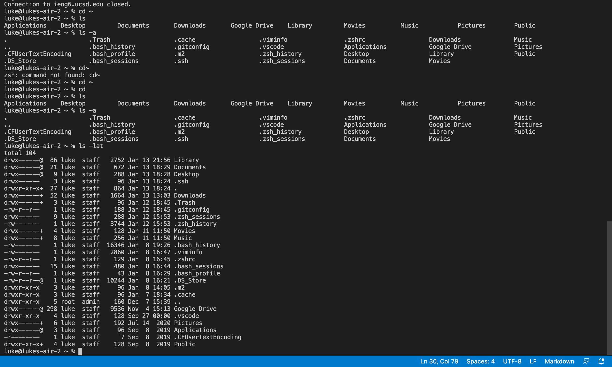
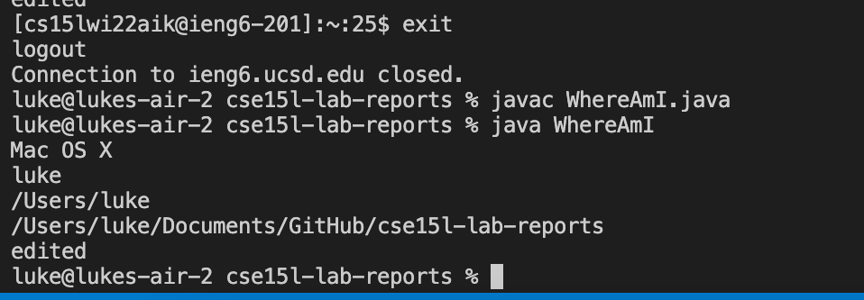
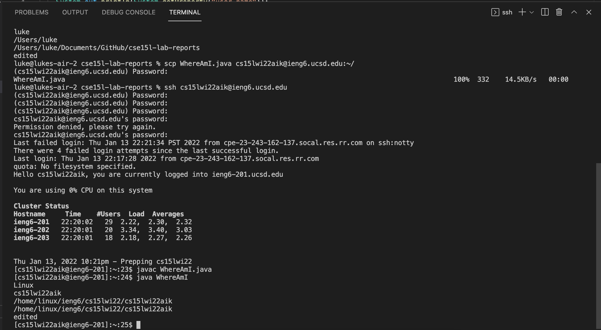
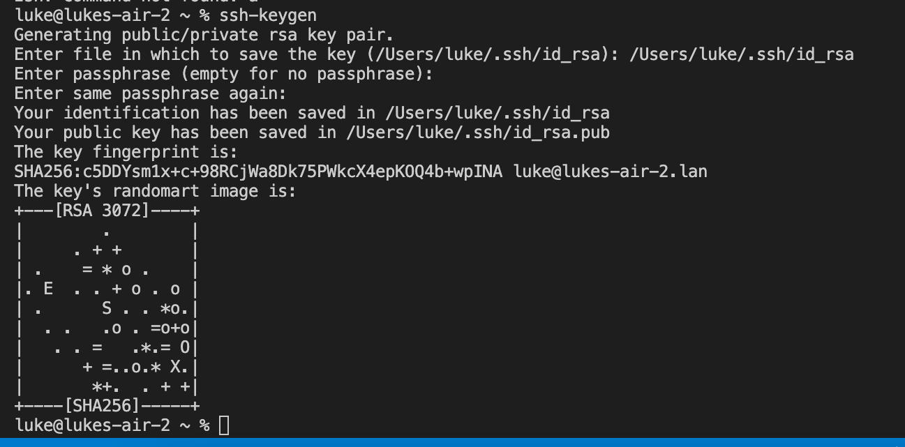
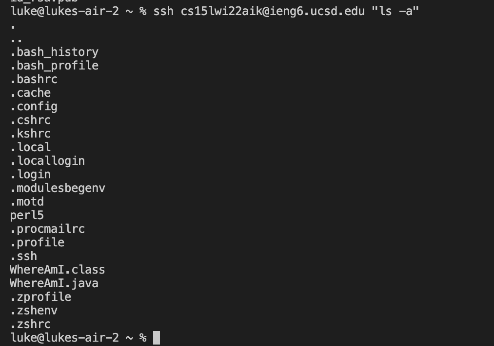

**Lab Report 1 for week 2:**
## Luke Hollestelle

---
# *Installing VScode:*
Click [here](https://code.visualstudio.com/) to visit the vscode website in
order to download the desktop application.

This screen should appear, and you can download by clicking on your
operating system.

# *Remotely Connecting:*
If you are using Windows, you will first need to download [OpenSSH](https://docs.microsoft.com/en-us/windows-server/administration/openssh/openssh_install_firstuse)

Every CSE15L student has a course-specific account, which can be accessed [here](https://sdacs.ucsd.edu/~icc/index.php)
Open the terminal, and type in:

`$ ssh cs15lwi22zzz@ieng6.ucsd.edu`

The 3 "z" characters in the adress will differ from student to student.

After logging in, you should see this screen, which means you are succesfully
connected to the remote server:

# *Trying some commands:*

* "cd" changes the directory you are currently on
* "cd ~" takes you to your home directory
* "pwd" prints the current directory
* "ls" shows you a list of all the files in the current directory
* "ls -a" shows you all the directories in ls, as well as the sub-directories.
* "ls lat" shows information about the directory, file sizes, last time a 
directory was opened, etc.
* "exit" returns you to your local device from the remote server

In the terminal, the commands print out as:

# *Moving Files with scp:*

You can move files over from your computer to a remote server using the scp command.

`$ scp FILENAMEHERE cs15lwi22zzz@ieng6.edu:~/`

This code will allow you to transfer whatever file is placed in the FILENAMEHERE
slot to the remote server, which is the ucsd computers in this case.

When I run a java file that prints out information about the current
system that it is running on, it has different outputs when I run it on my
computer vs. when I run it while logged into the remote server.

Ran from my computer:

Ran from the remote server:

Once we transfer files over to a remote server, we can run them
using the same commands like javac and java on that server.

# *SSH Keys:*

An SSH key creates a public and private key.  The public key is
stored somewhere on the server, while the private key is stored in your
client.

The command to create an SSH key is:

`$ ssh-keygen`

This should produce the following:

Next, login to the remote server and type in the following code:

`$ mkdir .ssh`

This will make a new directory on the server.  After this,
logout and type in:

`$ scp /Users/luke/.ssh/id_rsa.pub cs15lwi22aik@ieng6.ucsd.edu:~/.ssh/authorized_keys`

Fill in the username and corresponding ID numbers in the above code if necessary,
and you should be able to logon to the remote server now without using your password.

# *Optimizing Remote Running:*

Other ways to make running code on the remote server easier includes:
* Using arrow keys to reuse old lines of code
* You can use semicolons in between commands to run multiple commands
in one line
* You can run a command after logging onto a remote server by typing the command
in quotation marks afterwards.  This will directly run it on the server, and then exit.

Notice how it takes me back to my current local directory after I type
the "ls -a" command on the remote server.  This is helpful if you don't want
to login and exit.