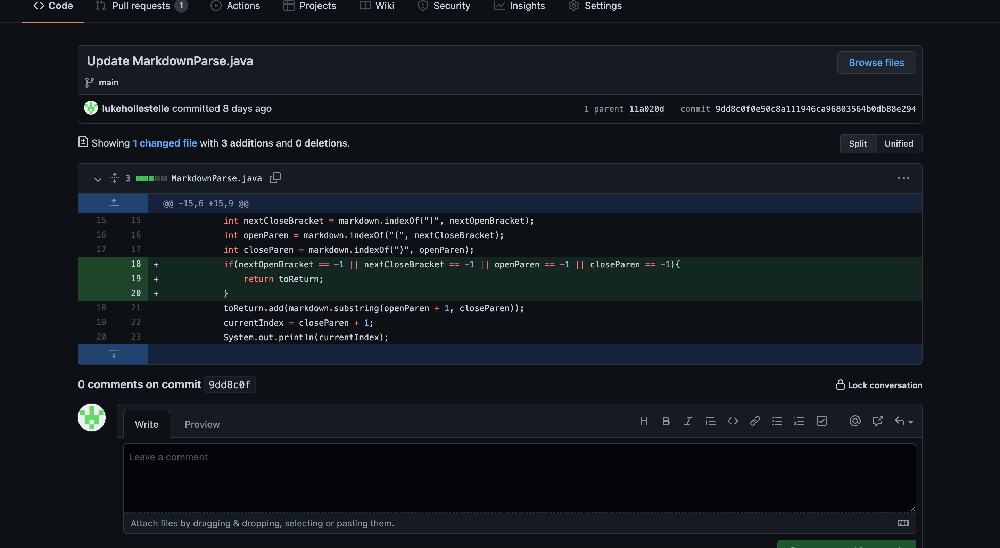
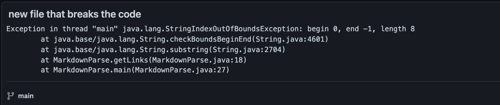
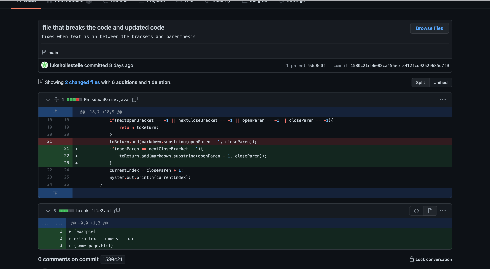
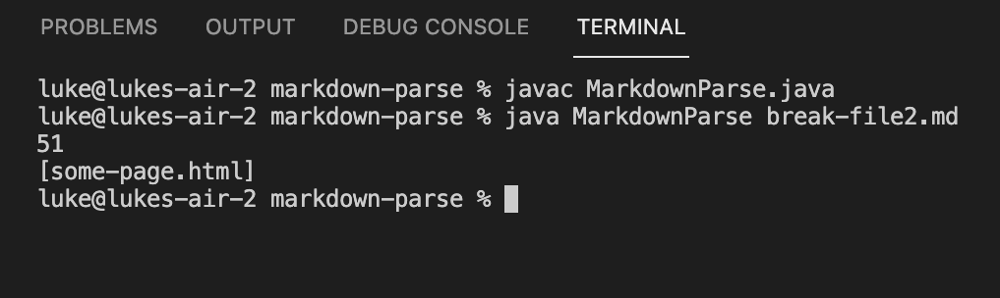
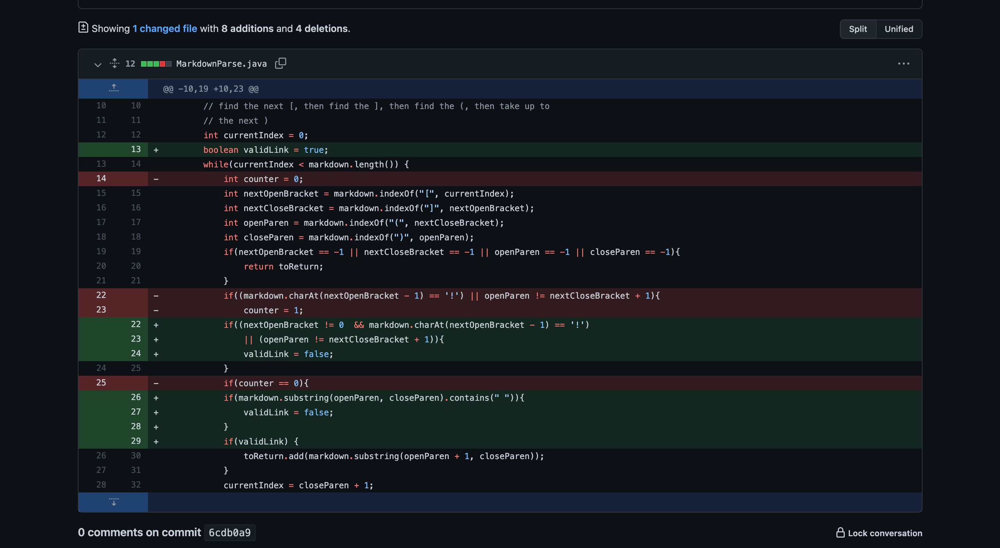
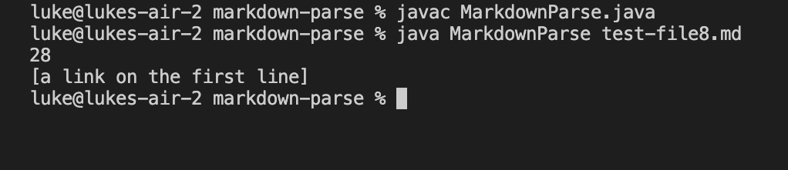

**Lab Report 2 for week 4:**
## Luke Hollestelle

---
# *First Bug:*

[Link to First Test File](https://github.com/lukehollestelle/cse15l-lab-reports/blob/main/week4/break-file.md)

The bug that was occurring was that if there were no paranthesis or brackets, the code would throw an IndexOutOfBoundsException.  We added code that checked if the file had a set of paranthesis and a set of brackets before proceeding in order to avoid this error.  If it didn't have these, it would just print nothing, which is the correct output for this scenario.

---

# *Second Bug:*

[Link to Second Test File](https://github.com/lukehollestelle/cse15l-lab-reports/blob/main/week4/break-file2.md)

Our code at this point would print out anything in parenthesis that came after a pair of brackets, even if they weren't directly next to each other.  A link in a file only appears if the parenthesis directly follow the brackets, so we added code that ensures they are next to each other in order to print the link.  Although no error shows for this file, it prints out the link in a case where we don't want it to.

---

# *Third Bug:*

[Link to Third Test File](https://github.com/lukehollestelle/cse15l-lab-reports/blob/main/week4/test-file8.md)

Our code hadn't been checking for whether or not the link within the parenthesis was actually a valid link or not.  This is why the sentence with spaces in it printed out as one of the links, even though we didn't want it to.  We created a method that checked if a substring from the first parenthesis to the closed parenthesis had a space, and if it did, to not print it out.  (I also fixed small errors in my code from before in this commit, which is why there are so many other changes)

---