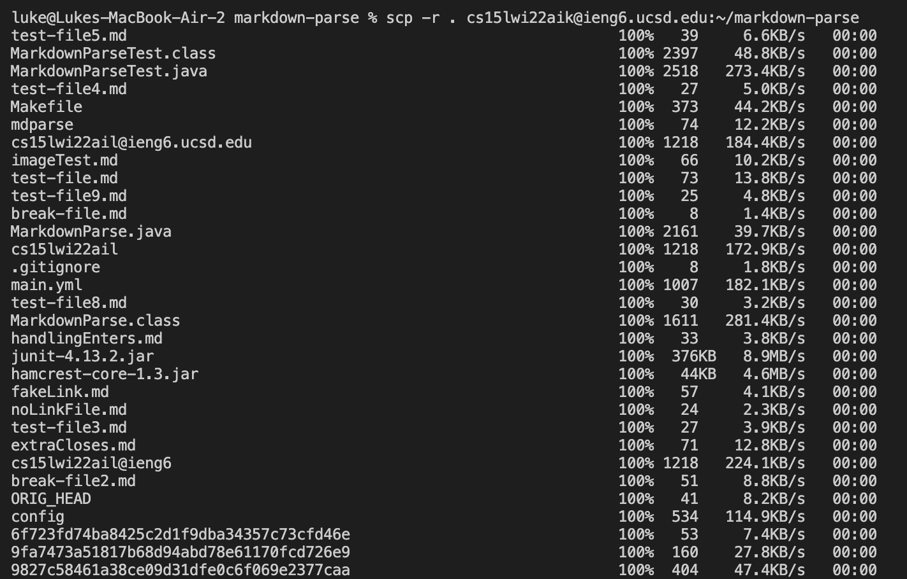
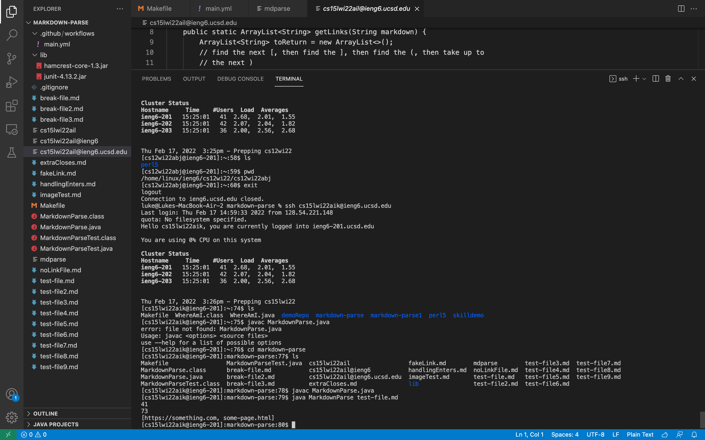
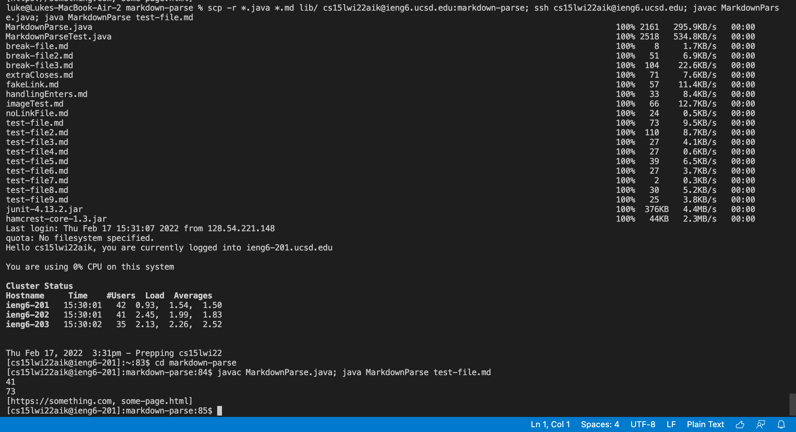

# Lab Report 3 Week 6
## Luke Hollestelle 

**Copy whole directories with** `scp -r`

In this screenshot, I am using the command scp -r to copy all of the files in my markdown-parse directory.  The -r commands means to do it recursively, which is why it is able to copy all of the files instead of just one.

---

This screenshot shows how I am able to run javac and java on ieng6 after copying over the files from the last step.  I used ssh to login with my username and password, and ls to make sure that the files were there.  This checks that I did the previous step correctly.

---

The final step is to save time and lines by running multiple commands on one line.  I first ran `scp -r` and `ssh` in the first line, while also attempting to run javac and java as well.  The `javac` and `java` commands didn't go through, but I was able to copy the files over and login with one command.  I then used `javac` and `java` in the same command on the next line to compile and run my code faster than before.  