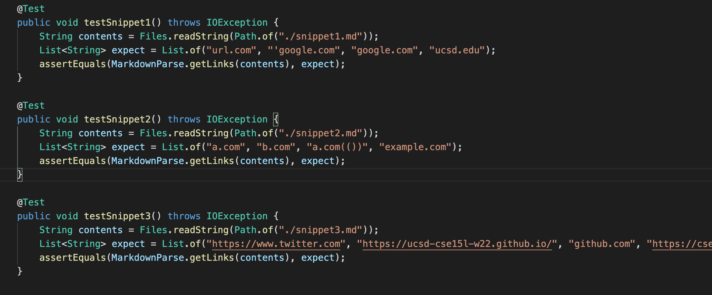
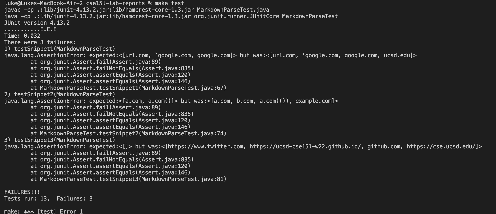
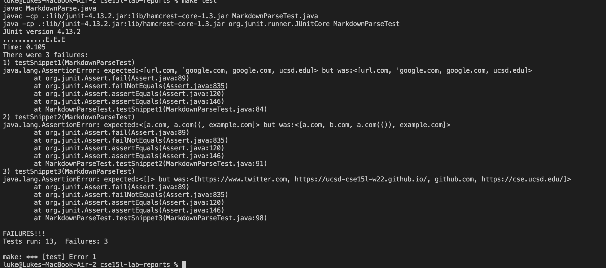

**Lab Report 4 for week 8:**
## Luke Hollestelle

---
# *Debuggers:*

My repository: https://github.com/lukehollestelle/markdown-parse1

Other group's repository: https://github.com/BasilThaddeus/markdown-parse

Here is the code that I wrote for the tests:

The tests did not pass for my markdownparse file, as well as basil's.  Here is the JUnit output for my markdown parse:

And here is basil's:

# Additional Questions:

I think that fixing snippet 1 would be possible to fix in less than 10 lines.  We could add a while loop that checks if the current index is not a backtick, and if it is, to not count it as a valid link.

I also think that fixing snippet 2 is possibled within 10 lines, because we looked at code in yesterday's lab that had similar function.  A while loop that determines whether there are any open brackets/parenthesis in between the current open bracket/parenthesis and the closed bracket/parenthesis would be useful in this scenario, which only returns the nested link as a valid link.

This also should be fixable within 10 lines in my opinion, because we could check if there is a `/n` in the link substring, and then set `validlink`, which is the variable that we use in my MarkdownParse.java file to determine if a link is valid or not, to false.